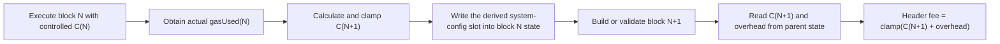

# TIP-1067-inspired base-fee design

## Overview

DogeOS will add a timestamp-gated, state-backed utilization controller while
retaining the existing L1-congestion overhead. The header continues to expose a
single `baseFeePerGas`, but protocol state preserves the controlled component so
an overhead change cannot be cancelled by subtracting it from a previously
clamped header.

The design deliberately keeps the controller in `dogeos-reth`. `dogeos-revm`
continues to consume the validated header base fee and requires no changes.

## Protocol parameters

The canonical DogeOS parameter set belongs in `dogeos-chainspec`, not in the
Tempo document and not duplicated across consumers.

| Parameter | Initial value | Purpose |
|---|---:|---|
| `LEGACY_MAX_L2_BASE_FEE` | `10_000_000_000` (10 Gwei) | Pre-activation compatibility cap |
| `BASE_FEE_FLOOR` | `10_000_000_000` (10 Gwei) | Minimum controlled component |
| `INITIAL_CONTROLLED_BASE_FEE` | `500_000_000_000` (500 Gwei) | Activation-block controlled seed |
| `MAX_L2_BASE_FEE` | `1_000_000_000_000` (1,000 Gwei) | Shared controlled-state and final-header cap |
| `GAS_TARGET` | `10_000_000` | Fixed long-run utilization target |
| `DENOMINATOR` | `8` | Adjustment rate |
| `DEFAULT_BASE_FEE_OVERHEAD` | `15_680_000` | Existing zero-slot fallback |
| `L2_BASE_FEE_OVERHEAD_SLOT` | `101` | Existing system-config overhead |
| `NEXT_CONTROLLED_BASE_FEE_SLOT` | `keccak256("dogeos.storage.dynamic_base_fee.next_controlled_fee")` | Domain-separated protocol-owned state |

The provisional cap rationale is
`DESIRED_CONTROLLED_FEE_CEILING = 999_900_000_000` (999.9 Gwei) plus
`OVERHEAD_BUDGET = 100_000_000` (0.1 Gwei). Only their 1,000 Gwei sum is
enforced as `MAX_L2_BASE_FEE`; both terms are downstream calibration inputs, not
additional clamps. The controlled state can still reach the shared cap.

## Controller contract

For the controlled fee accepted by the current block `C` and its actual total gas
usage `G`, calculate the next controlled fee `C'` using truncating integer
division:

```text
if G == GAS_TARGET:
    raw = C

if G > GAS_TARGET:
    gas_delta = G - GAS_TARGET
    fee_delta = max(1, C * gas_delta / GAS_TARGET / DENOMINATOR)
    raw = C + fee_delta

if G < GAS_TARGET:
    gas_delta = GAS_TARGET - G
    fee_delta = C * gas_delta / GAS_TARGET / DENOMINATOR
    raw = C - fee_delta

C' = clamp(raw, BASE_FEE_FLOOR, MAX_L2_BASE_FEE)
```

All multiplication and adjustment arithmetic uses `u128`. The largest permitted
input product is bounded by `MAX_L2_BASE_FEE * u64::MAX`, which fits in `u128`;
the implementation should nevertheless use checked operations and convert to
`u64` only after both clamps.

For a controlled component `C` and canonical overhead `O`, the header value is:

```text
baseFeePerGas = min(U256(C) + O, U256(MAX_L2_BASE_FEE))
```

Using `U256` for composition avoids narrowing or overflowing a configured
overhead. A zero overhead slot retains the existing fallback behavior.

## State model

`NEXT_CONTROLLED_BASE_FEE_SLOT` stores the controlled component to be used by the
next executed block, not the gas used by the preceding block.



This is algebraically equivalent to calculating a child from
`parent.gas_used()`, while avoiding a duplicate gas counter and avoiding a parent
header lookup inside the imported-block executor.

The slot namespace is
`dogeos.storage.dynamic_base_fee.next_controlled_fee`. Its Keccak-256 value is
`0x74ae897ed5751dd32419f1eee8d4ec13d296adf0d77978ea55df0dd18345c8e3`.
The code stores the precomputed `U256` constant for efficiency and includes a
derivation test using Alloy's `keccak256`, preventing namespace or endianness
drift. A shared derivation/verification helper establishes the same convention
for all future DogeOS protocol-owned slots; new slots must use distinct stable
namespaces instead of sequential integers.

The configured account is absent from the bundled mainnet/Chikyu genesis alloc.
When the first write targets an absent or EIP-161-empty account, the protocol
transition sets nonce `1` while preserving any existing code, balance, and nonce.
This keeps the one non-zero storage slot from being discarded as a touched empty
account. Later writes preserve the resulting account information.

The write must use the existing `transitions::commit_account_update` path so
original storage is loaded before `DatabaseCommit`; this retains witness and
revert data in REVM's `State` overlay.

## Activation and compatibility

The controller reuses the existing DogeOS `Tsuki` timestamp hardfork. It adds no
hardfork enum variant, genesis field, or schedule entry.

- Before Tsuki, the current Feynman calculation and 10 Gwei cap are unchanged.
- On the first Tsuki-active executed block, the derived slot is
  zero/uninitialized, so its controlled component is
  `INITIAL_CONTROLLED_BASE_FEE`.
- The activation header is
  `min(INITIAL_CONTROLLED_BASE_FEE + parent_state_overhead, MAX_L2_BASE_FEE)`.
- At activation-block completion, the executor calculates the following
  controlled value from the seed and activation block's actual gas usage, then
  writes the derived slot.
- On later blocks, a non-zero slot is required to be no greater than
  `MAX_L2_BASE_FEE`; it becomes the current controlled component.

Zero is an unambiguous initialization sentinel because every value written by the
controller is at least `BASE_FEE_FLOOR`.

The target deployment has not activated Tsuki, so no already-active state
migration is required. Existing bundled schedule values are left untouched; the
downstream release owner owns the actual Tsuki timestamp. Compatibility with a
non-target chain that already activated Tsuki without this controller is an
accepted out-of-scope risk.

## Canonical ownership and data flow

### Chainspec and hardforks

- `dogeos-hardforks` already owns the Tsuki activation helper; no new fork is
  added.
- `dogeos-chainspec` owns the parameter values and legacy/Tsuki-cap selection;
  existing schedules remain unchanged.
- The fee change does not select a new REVM `ScrollSpecId`; it changes DogeOS
  header/state policy at the existing Tsuki boundary.

### Fee controller

`dogeos-reth-evm/src/base_fee.rs` remains the canonical calculation module. It
will expose focused operations for:

1. reading canonical overhead;
2. reading the controlled component for the current block (seed or slot);
3. composing the expected header fee;
4. calculating the next controlled component; and
5. calculating the next block fee for existing payload/RPC callers while
   retaining the pre-fork path.

No caller may reimplement the formula or slot interpretation.

### Payload production and RPC

The existing payload builder and `eth_feeHistory` call sites continue to use
`ScrollBaseFeeProvider::next_block_base_fee`. Post-activation it reads the
already-computed controlled component from parent state; pre-activation it keeps
using the parent header and legacy EIP-1559 calculation.

Txpool and transaction-selection code continue to consume the base fee supplied
by the canonical header/payload environment. They do not read controller state or
implement an independent update rule.

### Validation

Validation is split according to available inputs:

- `DogeosConsensus` becomes chain-spec aware and enforces presence plus the
  fork-appropriate absolute cap: 10 Gwei before Tsuki, 1,000 Gwei at and after
  Tsuki.
- `ScrollBlockExecutor::apply_pre_execution_changes` has parent state and the
  current header/EVM environment. At and after Tsuki it reads the derived slot
  (or the activation seed), reads overhead, computes the canonical expected
  header fee, and rejects any mismatch before transactions execute.
- Existing post-execution consensus verifies actual total gas against header
  `gasUsed`. The executor uses that same actual total when writing the following
  controlled fee.

This makes producer and importer use the same state-backed contract without
injecting a provider into `ScrollEvmConfig` or coupling stateless header download
to state availability.

## Execution ordering

For every block:

1. Determine whether Tsuki is active from the current timestamp.
2. If active, validate current header fee from parent state before transaction
   execution.
3. Apply existing hardfork transitions and EIP-2935 behavior.
4. Execute transactions and accumulate actual gas.
5. If active, calculate the following controlled component and commit the
   derived slot before returning the final EVM/state overlay.
6. Existing block assembly/state-root and post-execution consensus checks run.

The post-execution write occurs on payload building and imported-block execution
through the shared executor. It is never written directly by payload or RPC code.

## Failure behavior

Execution fails closed when:

- the active header base fee differs from the state-derived expected value;
- a non-zero controlled slot exceeds `MAX_L2_BASE_FEE` or cannot be represented;
- checked controller arithmetic fails; or
- reading/writing system-config state fails.

Errors must report expected/actual fees or the invalid controller value without
panicking. Pre-activation behavior remains unchanged.

## Tests

Unit tests cover formula equality, minimum increase, rounding, floor, both uses of
the shared cap, maximum gas inputs, and overhead composition. State-transition
tests cover activation seeding, namespace derivation, absent-account nonce
initialization, existing-account preservation, repeated writes, and REVM
bundle/revert output.

Cross-layer tests cover:

- the unchanged Tsuki schedule and pre-/post-Tsuki boundary;
- legacy versus dynamic stateless cap enforcement;
- exact executor rejection for activation and later blocks;
- payload construction and execution agreeing on the same fee;
- `eth_feeHistory` returning the slot-backed next fee; and
- no changes to gas-limit defaults or DogeOS genesis hashes.

## Rollback and handoff

Because the target deployment has not activated Tsuki, the implementation can be
reverted before its Tsuki activation without a state migration. Once activated,
reverting the rule would require another hardfork; ordinary node downgrade is
unsafe.

The downstream release owner must confirm the Tsuki timestamp, revalidate the
10/500/1,000 Gwei values, replace or approve the provisional overhead allowance,
and recheck the ETH/DOGE comparison. Publishing, monitoring deployment, and
production operation remain out of scope.
